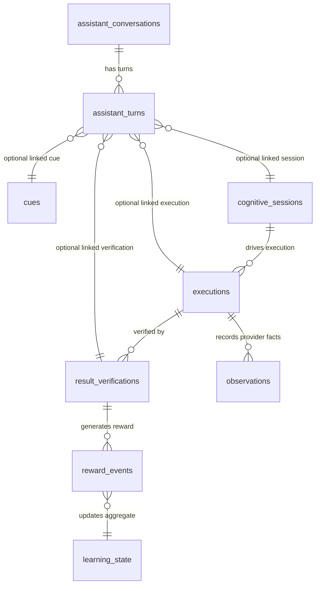

# AutoDo AI — PostgreSQL Database Guide

This guide explains how the AutoDo AI database is structured, how to connect to PostgreSQL, and how to query conversations, turns, sessions, and cognitive records.

---

## 1. Database Connection & Environment

AutoDo AI uses PostgreSQL with Drizzle ORM.

### Connection Parameters (from `.env.local`)

| Setting | Default / Test Environment | Description |
|---|---|---|
| **Host** | `127.0.0.1` | Local PostgreSQL instance |
| **Port** | `5432` | Standard PostgreSQL port |
| **Test Database** | `autodo_ai_test` | Used for integration tests & local verification |
| **Dev Database** | `autodo_ai` | Primary application database |
| **Test User** | `autodo_test` | Application database user |

---

## 2. Connecting with `psql`

### Method A: Connect as postgres superuser (via `sudo`)

```bash
sudo -u postgres psql -d autodo_ai_test
```

### Method B: Connect via TCP localhost (`-h 127.0.0.1`)

```bash
psql -h 127.0.0.1 -U autodo_test -d autodo_ai_test
```

*(Enter the password configured in your `.env.local`).*

---

## 3. Database Schema Overview



---

## 4. Table Catalog & Purpose

### Conversational Assistant (Milestones 8.7 – 8.10)

| Table Name | Description | Key Fields |
|---|---|---|
| `assistant_conversations` | Tracks high-level conversational threads. | `conversation_id`, `turn_count`, `created_at`, `updated_at`, `expires_at` |
| `assistant_turns` | Stores individual user/assistant turns in a conversation. | `turn_id`, `conversation_id`, `ordinal`, `user_message`, `assistant_message`, `kind`, `status`, `cue_id`, `session_id`, `execution_id`, `verification_id` |

### Cognitive Core & Autonomous Execution (Milestones 8.1 – 8.5)

| Table Name | Description | Key Fields |
|---|---|---|
| `cues` | Ingress event records (e.g. chat turn, webhook). | `cue_id`, `source`, `external_event_id`, `type`, `payload`, `received_at` |
| `cognitive_sessions` | Autonomous cognitive cycle state machine. | `session_id`, `cue_id`, `phase`, `failure_count`, `retry_count`, `cooldown_until` |
| `executions` | Autonomous execution ledger. | `execution_id`, `session_id`, `plan_id`, `status`, `started_at`, `completed_at` |
| `observations` | Factual provider output records. | `observation_id`, `execution_id`, `source`, `data`, `observed_at` |
| `result_verifications` | Immutable verification results. | `verification_id`, `execution_id`, `status`, `confidence`, `reason`, `verified_at` |
| `reward_events` | Append-only reward ledger (+5, +10, -10). | `reward_event_id`, `execution_id`, `verification_id`, `signal`, `value`, `reason` |
| `learning_state` | Aggregated skill projections. | `skill_key`, `confidence`, `total_reward`, `sample_count` |
| `verified_memory` | Verified long-term memory entries. | `memory_id`, `kind`, `memory_key`, `content`, `confidence`, `verified_at` |

---

## 5. Useful SQL Queries

### A. View All Conversations

```sql
SELECT 
    conversation_id, 
    turn_count, 
    created_at, 
    updated_at 
FROM assistant_conversations 
ORDER BY updated_at DESC;
```

### B. View Turns and Messages for a Specific `conversation_id`

```sql
SELECT 
    ordinal,
    status,
    kind,
    user_message,
    assistant_message,
    created_at,
    completed_at
FROM assistant_turns
WHERE conversation_id = 'YOUR_CONVERSATION_ID'
ORDER BY ordinal ASC;
```

### C. View All Tool-Backed Turns (with Linked Execution & Verification IDs)

```sql
SELECT 
    turn_id,
    conversation_id,
    status,
    cue_id,
    session_id,
    execution_id,
    verification_id,
    created_at
FROM assistant_turns
WHERE session_id IS NOT NULL
ORDER BY created_at DESC;
```

### D. View Verified Observations from an Execution

```sql
SELECT 
    observation_id,
    execution_id,
    source,
    data,
    observed_at
FROM observations
ORDER BY observed_at DESC
LIMIT 10;
```

### E. View Reward Events & Learning Scores

```sql
-- Reward Events:
SELECT reward_event_id, execution_id, signal, value, reason, created_at 
FROM reward_events 
ORDER BY created_at DESC;

-- Learning Projections:
SELECT skill_key, confidence, total_reward, sample_count, updated_at 
FROM learning_state;
```

---

## 6. Helpful `psql` Shortcuts

- `\dt` — List all tables
- `\d table_name` — Describe columns, constraints, and indexes of a table
- `\l` — List all databases
- `\c database_name` — Connect / switch to another database
- `\x` — Toggle expanded output (helpful when viewing long text/JSON messages)
- `\q` — Quit `psql`
