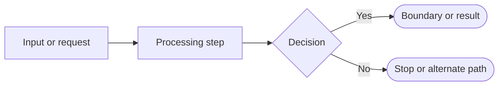

# AutoDo AI Mermaid Flows

Read these diagrams in order. Each file focuses on one level of the system so the complete flow is easier to follow.

| Step | Document | Purpose |
| --- | --- | --- |
| 1 | [Project overview](./flow1-project-overview.md) | See the entire system at a glance. |
| 2 | [API entry points](./flow2-api-entry-points.md) | See how browser and API requests enter the application. |
| 3 | [Cue ingestion](./flow3-cue-ingestion.md) | See how a durable cognitive session begins. |
| 4 | [Cognitive loop](./flow4-cognitive-loop.md) | Follow every cognitive phase and decision boundary. |
| 5 | [Execution and verification](./flow5-execution-verification.md) | See how an allowed plan becomes a verified result. |
| 6 | [Failure and recovery](./flow6-failure-recovery.md) | See retry, cooldown, reconciliation, and human-review paths. |
| 7 | [Assistant chat](./flow7-assistant-chat.md) | See direct answers and tool-backed answers. |
| 8 | [Persistence](./flow8-persistence.md) | See how the domain is stored in PostgreSQL. |

## Reading key

The diagrams describe the current implementation under `src/app` and `src/features/cognitive`. The older `src/features/cognitive/FLOW.md` remains useful for detailed domain rules.
