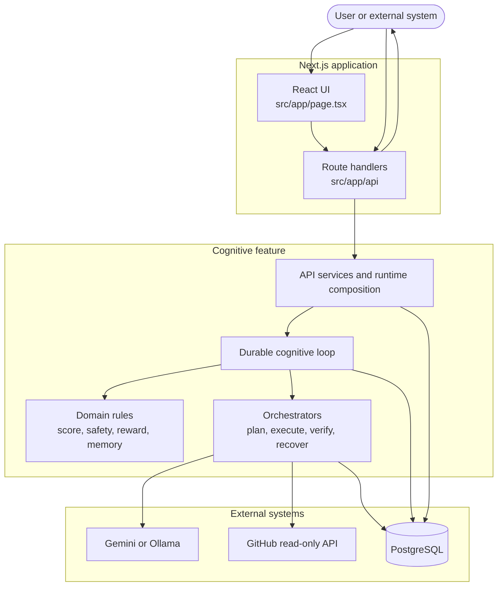
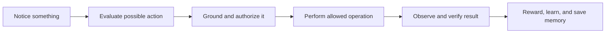

# Flow 1 — Project Overview

This is the best starting point. AutoDo AI is a Next.js App Router application with a React UI, route-handler APIs, a durable cognitive engine, external providers, and PostgreSQL persistence.

## Main idea

The AI can propose or interpret work, but domain policy, grounding, authorization, durable state, and result verification control whether that work proceeds.
