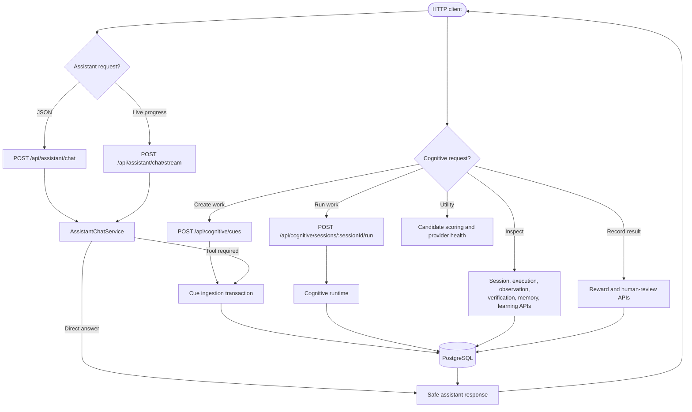
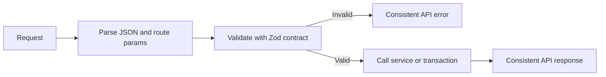

# Flow 2 — API Entry Points

Next.js `route.ts` files under `src/app/api` expose the backend. Dynamic folders such as `[sessionId]` become URL parameters.

```mermaid
flowchart TD
    CLIENT(["HTTP client"])

    CLIENT --> ASSISTANT{"Assistant request?"}
    ASSISTANT -->|JSON| CHAT["POST /api/assistant/chat"]
    ASSISTANT -->|Live progress| STREAM["POST /api/assistant/chat/stream"]
    CHAT --> CHAT_SERVICE["AssistantChatService"]
    STREAM --> CHAT_SERVICE

    CLIENT --> COG{"Cognitive request?"}
    COG -->|Create work| CUE["POST /api/cognitive/cues"]
    COG -->|Run work| RUN["POST /api/cognitive/sessions/:sessionId/run"]
    COG -->|Inspect| READ["Session, execution, observation,<br/>verification, memory, learning APIs"]
    COG -->|Record result| WRITE["Reward and human-review APIs"]
    COG -->|Utility| UTIL["Candidate scoring and provider health"]

    CUE --> INGEST["Cue ingestion transaction"]
    RUN --> RUNTIME["Cognitive runtime"]
    CHAT_SERVICE -->|Tool required| INGEST
    CHAT_SERVICE -->|Direct answer| RESPONSE["Safe assistant response"]
    INGEST --> DB[("PostgreSQL")]
    RUNTIME --> DB
    READ --> DB
    WRITE --> DB

    DB --> RESPONSE
    RESPONSE --> CLIENT
```

## Request handling pattern

```mermaid
flowchart LR
    REQUEST["Request"] --> PARSE["Parse JSON and route params"]
    PARSE --> VALIDATE["Validate with Zod contract"]
    VALIDATE -->|Invalid| ERROR["Consistent API error"]
    VALIDATE -->|Valid| USECASE["Call service or transaction"]
    USECASE --> RESPONSE["Consistent API response"]
```
