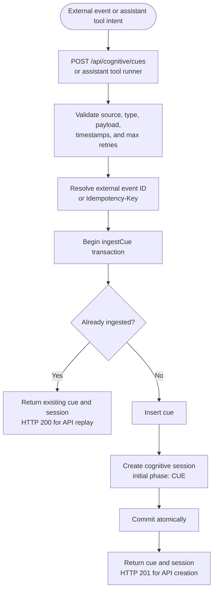
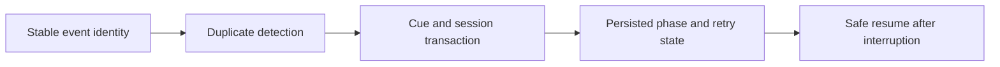

# Flow 3 — Cue Ingestion

A cue is the durable starting point for cognitive work. Ingestion creates the cue and its session together and protects retries with an idempotency identity.

## Why it is durable

