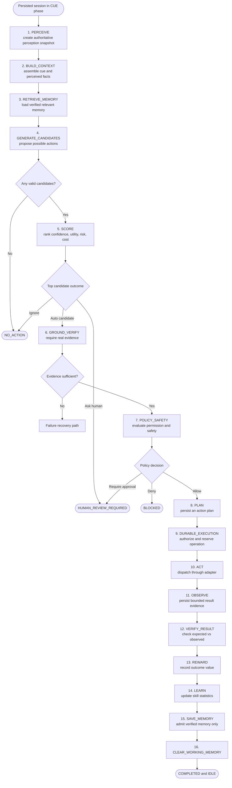
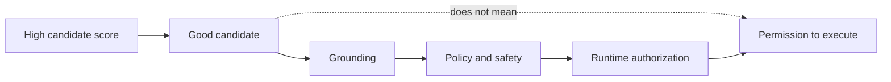

# Flow 4 — Cognitive Loop

The driver advances exactly one persisted phase at a time. `runCognitiveCycleUntilBoundary` repeatedly calls that transition until it reaches a result that must be returned to the caller.

## Core safety rule

