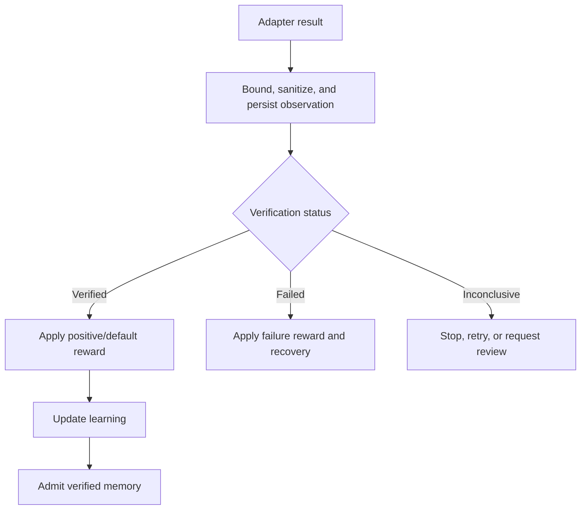

# Flow 5 — Execution and Verification

Execution is separated into preparation, authorization, reservation, dispatch, observation, and verification. This prevents an AI proposal from directly becoming an external call.

```mermaid
sequenceDiagram
    participant Loop as Cognitive loop
    participant Policy as Policy and safety
    participant DB as PostgreSQL ledger
    participant Adapter as GitHub read-only adapter
    participant Verifier as Result verifier

    Loop->>Policy: Evaluate grounded candidate
    Policy-->>Loop: ALLOW
    Loop->>DB: Persist plan
    Loop->>DB: Prepare execution and safety state
    Loop->>DB: Issue scoped authorization
    Loop->>DB: Reserve operation with fingerprint
    Loop->>DB: Mark execution and step started
    Loop->>Adapter: Dispatch authorized operation
    Adapter-->>Loop: Provider response or error
    Loop->>DB: Record operation attempt and observation
    Loop->>Verifier: Compare observation with expected result
    Verifier-->>Loop: VERIFIED, FAILED, or INCONCLUSIVE
    Loop->>DB: Persist verification and final execution state
```

## Result path


