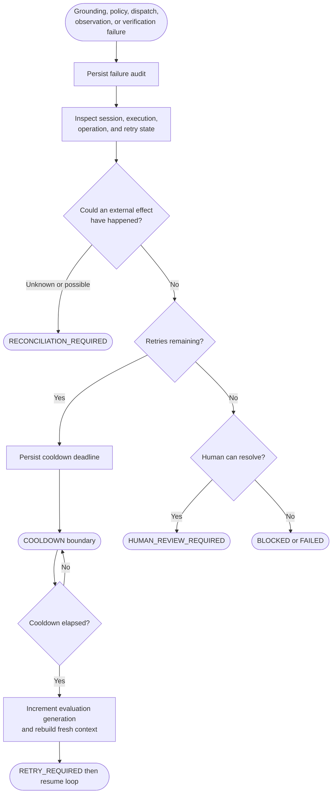
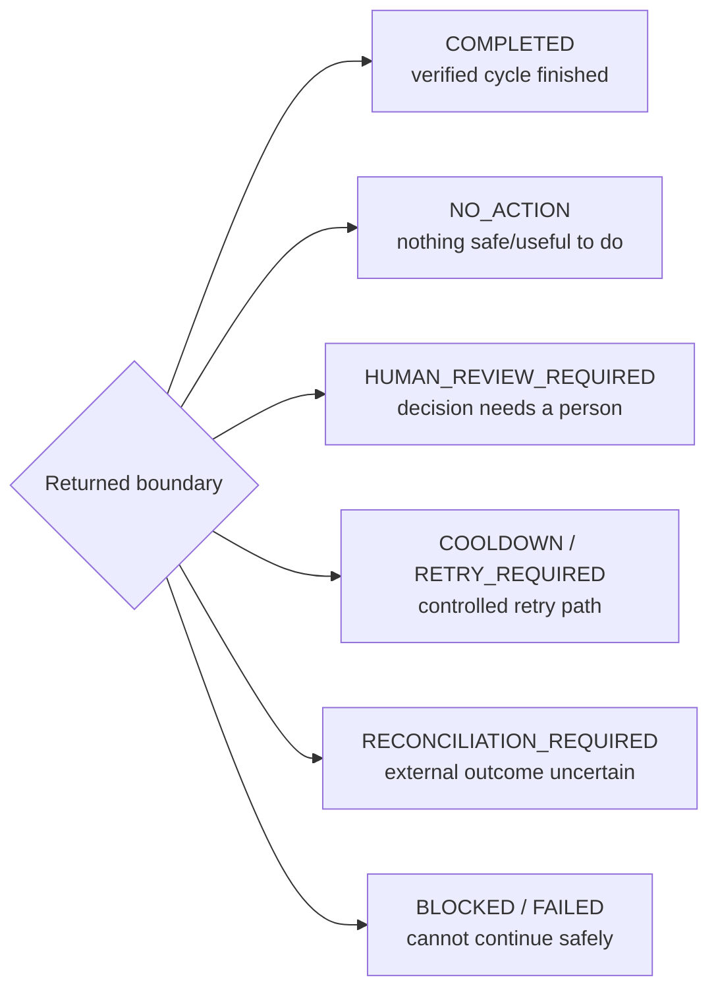

# Flow 6 — Failure and Recovery

Failures do not automatically repeat external work. The recovery path checks persisted execution and operation state before deciding what is safe.

## Boundary meanings

