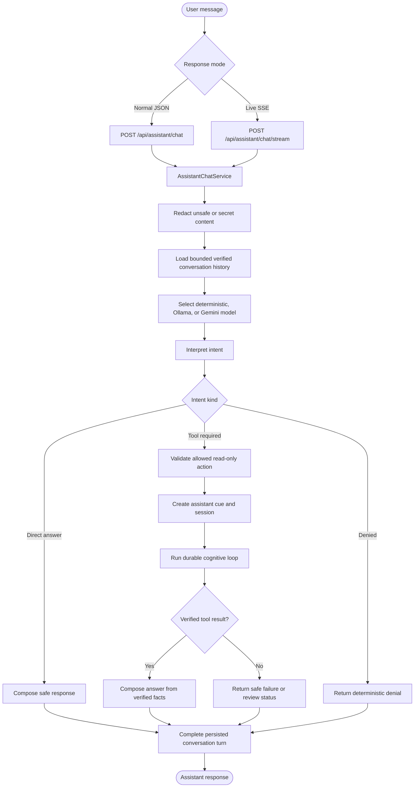
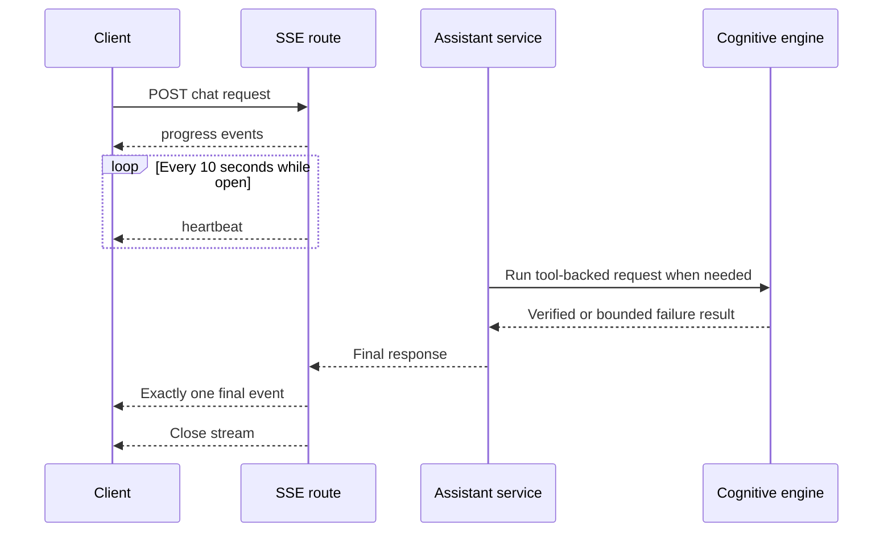

# Flow 7 — Assistant Chat

Assistant chat can answer directly or translate a safe read-only intent into the same durable cognitive pipeline used by the cognitive API.

```mermaid
flowchart TD
    USER(["User message"])
    USER --> ENDPOINT{"Response mode"}
    ENDPOINT -->|Normal JSON| CHAT["POST /api/assistant/chat"]
    ENDPOINT -->|Live SSE| STREAM["POST /api/assistant/chat/stream"]
    CHAT --> SERVICE["AssistantChatService"]
    STREAM --> SERVICE
    SERVICE --> REDACT["Redact unsafe or secret content"]
    REDACT --> HISTORY["Load bounded verified conversation history"]
    HISTORY --> ROUTE["Select deterministic, Ollama, or Gemini model"]
    ROUTE --> INTENT["Interpret intent"]
    INTENT --> KIND{"Intent kind"}
    KIND -->|Direct answer| COMPOSE["Compose safe response"]
    KIND -->|Tool required| SAFETY["Validate allowed read-only action"]
    KIND -->|Denied| DENIAL["Return deterministic denial"]
    SAFETY --> CUE["Create assistant cue and session"]
    CUE --> LOOP["Run durable cognitive loop"]
    LOOP --> VERIFIED{"Verified tool result?"}
    VERIFIED -->|Yes| FACTS["Compose answer from verified facts"]
    VERIFIED -->|No| SAFE_FAIL["Return safe failure or review status"]
    FACTS --> STORE["Complete persisted conversation turn"]
    COMPOSE --> STORE
    DENIAL --> STORE
    SAFE_FAIL --> STORE
    STORE --> RESPONSE(["Assistant response"])
```

## Streaming response

```mermaid
sequenceDiagram
    participant Client
    participant Route as SSE route
    participant Service as Assistant service
    participant Engine as Cognitive engine

    Client->>Route: POST chat request
    Route-->>Client: progress events
    loop Every 10 seconds while open
        Route-->>Client: heartbeat
    end
    Service->>Engine: Run tool-backed request when needed
    Engine-->>Service: Verified or bounded failure result
    Service-->>Route: Final response
    Route-->>Client: Exactly one final event
    Route-->>Client: Close stream
```
