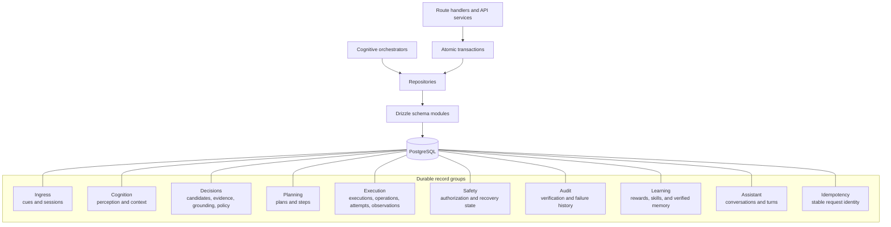
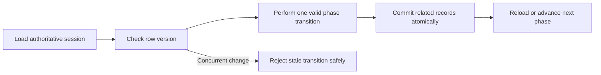

# Flow 8 — Persistence

PostgreSQL is the durable ledger for the cognitive engine. Drizzle schemas define records by responsibility, while repositories and transactions isolate database access from orchestration.

## State consistency

Schema files live in `src/features/cognitive/persistence/postgres/schema`, migrations live in `drizzle`, and database documentation lives in `docs/database`.
